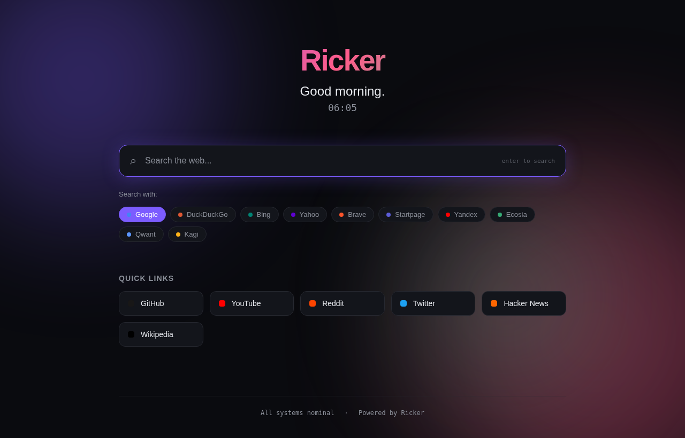

<div align="center">

# Ricker

### *A clean, modern desktop browser that gives you ten search engines without ten installs.*

<br>

<p>
  
  
  
  
  
</p>

<br>



</div>

## What this is

Ricker is a desktop browser built on PyQt5's QWebEngineView (which is Chromium under the hood, the same engine that runs Chrome and Edge). It comes with a modern dashboard homepage and instant access to ten search engines: Google, DuckDuckGo, Bing, Yahoo, Brave, Startpage, Yandex, Ecosia, Qwant, Kagi.

The point isn't to replace Chrome. The point is that when you want to compare search results across engines, you don't need ten browser windows or ten extensions. Click a chip on the homepage, type your query, see results. Click another chip, same query, different engine. One app, ten lenses.

## Why I built it

I kept noticing that Google, DuckDuckGo, and Brave all give meaningfully different results for the same query. Sometimes Brave finds a Reddit thread Google has buried. Sometimes DuckDuckGo surfaces the documentation page Bing missed. The "right" search engine depends on what you're looking for.

I wanted one place to switch between them without juggling tabs, browser windows, or extensions that try to inject themselves into Chrome's sidebar. Ricker is that place.

## Features

| Feature | What it does |
|---------|--------------|
| **Tabbed browsing** | Multiple pages open at once, draggable, closable |
| **10 search engines** | Switch via dropdown on each tab, or pick before searching from the homepage |
| **Modern dashboard** | New tab opens to a clean homepage with search bar, time-aware greeting, clock, quick links |
| **Dark theme** | Built-in. Toggle with `Ctrl+Shift+T`. Light theme included too |
| **Standard shortcuts** | `Ctrl+T` new tab, `Ctrl+W` close tab, `Ctrl+L` focus URL bar, `Ctrl+R` reload, `Ctrl+Q` quit |
| **Smart URL bar** | Type a URL to navigate, type a query to search via your current engine |
| **Direct URL detection** | `github.com` works, no need to type the full `https://...` |
| **Custom homepage** | Set any URL as your homepage via Settings menu |

## How it works

```
┌────────────────────────────────────────────────────────┐
│   Ricker (PyQt5 main process)                          │
│                                                        │
│   ┌──────────────────┐    ┌──────────────────────────┐ │
│   │ QMainWindow      │    │ Background Thread        │ │
│   │  + QTabWidget    │    │  Flask server            │ │
│   │  + QMenuBar      │    │  (homepage on            │ │
│   │  + QStatusBar    │    │   localhost:5000)        │ │
│   │                  │    └──────────────────────────┘ │
│   │  ┌────────────┐  │                                 │
│   │  │ BrowserTab │  │    Each new tab loads          │
│   │  │  Toolbar   │──┼─►  http://127.0.0.1:5000/      │
│   │  │  Web view  │  │    by default                  │
│   │  │  (Chromium)│  │                                 │
│   │  └────────────┘  │                                 │
│   └──────────────────┘                                 │
└────────────────────────────────────────────────────────┘
```

The architecture has three layers.

**The window.** A PyQt5 `QMainWindow` holds a `QTabWidget`. Each tab is its own self-contained `BrowserTab` with a toolbar (back, forward, reload, home, URL bar, engine picker) and a `QWebEngineView`. The `QWebEngineView` is real Chromium, so it renders modern web pages exactly as Chrome would.

**The homepage server.** A Flask app runs in a background daemon thread, serving the dashboard HTML on a free local port (5000 by default, falls back if taken). The dashboard is a static page with a clock, greeting, search bar, engine picker chips, and quick links. JavaScript routes searches through the selected engine's URL pattern.

**The styling.** All the QSS (Qt's CSS-like styling language) lives in `app/styles.py` as Python f-strings. Themes are dictionaries of color tokens. Switching theme means re-rendering one stylesheet, not hunting through twenty widget classes.

## Stack

| Layer | Tech | Why |
|-------|------|-----|
| GUI | **PyQt5** | Mature, native-feeling, gives us a real Chromium webview |
| Web rendering | **QWebEngineView** | Embedded Chromium, full modern web support |
| Homepage backend | **Flask** | Tiny, no magic, perfect for a single static page |
| Styling | **QSS** (Qt Style Sheets) | Like CSS but for Qt widgets |
| Threading | **Python threading** | Flask runs in a daemon thread, dies cleanly with the app |

## Running it

```bash
git clone https://github.com/RicKanjilal/Ricker_Browser.git
cd Ricker_Browser
pip install -r requirements.txt
python ricker.py
```

That's it. The Flask server starts on localhost (auto-picks 5000 or the next free port), the PyQt5 window opens, you start browsing.

### Keyboard shortcuts

| Shortcut | Action |
|----------|--------|
| `Ctrl+T` | New tab |
| `Ctrl+W` | Close current tab |
| `Ctrl+L` | Focus URL bar (and select all) |
| `Ctrl+R` | Reload current page |
| `Ctrl+Shift+T` | Toggle dark/light theme |
| `Ctrl+Q` | Quit |

## Project structure

```
Ricker_Browser/
├── ricker.py                    Entry point
├── app/
│   ├── browser_window.py        Main QMainWindow with tab management
│   ├── tab_widget.py            Single tab: toolbar + webview
│   ├── engines.py               Search engine registry
│   ├── flask_server.py          Background Flask thread
│   └── styles.py                Themes and stylesheet builder
├── homepage/
│   ├── templates/
│   │   └── homepage.html        Dashboard HTML
│   └── static/
│       ├── homepage.css         Dashboard styling
│       └── homepage.js          Clock, engine picker, search routing
├── assets/                      Screenshots and icons
├── requirements.txt
└── README.md
```

## What I'd do differently in a v2

The current version works and looks good, but there are real things I'd want to add:

- **Session persistence.** Tabs and history don't survive restarts. Adding a small SQLite-backed session store would fix that.
- **Bookmarks.** No bookmark UI right now. The dashboard could show recently-visited sites.
- **Keyboard navigation for engine chips.** Currently you click chips. Tab + Enter would be more keyboard-driven.
- **Profile separation.** Run different sets of cookies/storage for different "profiles" (work, personal). PyQt5's `QWebEngineProfile` supports this directly.
- **Adblock.** A simple URL blocklist would catch most ads. Real adblocking via uBlock-style filter lists is a bigger project.
- **History search.** A `Ctrl+H` palette that searches across page titles you've visited.

## License

MIT. Fork it, add features, make your own better browser.

---

<div align="center">
<sub>Built by <a href="https://github.com/RicKanjilal"><b>Ric Kanjilal</b></a> · Don Bosco School, Liluah · Kolkata</sub>
</div>
